<h2>TensorFlow-FlexUNet-Image-Segmentation-3D-CT-Kidney-Tumor (2026/05/07)</h2>
Sarah T. Arai 
Software Laboratory antillia.com  
This is the first experiment of Image Segmentation for <b>3D-CT-Kidney-Tumor (3 classes)</b> based on 
our <a href="./src/TensorFlowFlexUNet.py">TensorFlowFlexUNet</a>
 (<b>TensorFlow Flexible UNet Image Segmentation Model for Multiclass</b>), and a PNG
 <a href="https://drive.google.com/file/d/1T8EW7ip9XDVstkREqQ3zljYWvzRlWHYn/view?usp=sharing">
3D-CT-Kidney-Tumor-ImageMask-Dataset.zip</a> (<a href="https://creativecommons.org/publicdomain/zero/1.0/">
CC0: Public Domain
</a>), which was derived by us from   
<a href="https://www.kaggle.com/datasets/fizzazaitoonbsds2022/3d-kidney-tumor-segmentation/data">
<b>3D CT Kidney for Tumor Segmentation
</b>
</a> by Fizza Zaitoon.
  

<b>Actual Image Segmentation for 3D-CT-Kidney-Tumor Images of 512x512 pixels</b> 
As shown below, the inferred masks predicted by our segmentation model trained by the dataset appear similar to the ground truth masks,
 but they lack precision in certain areas.
  
<b>class_color_map = {Kidney:blue, Cyst:green, Tumor:red}</b>
  
<table>
<tr>
<th>Input: image</th>
<th>Mask (ground_truth)</th>
<th>Prediction: inferred_mask</th>
</tr>
<tr>
<td>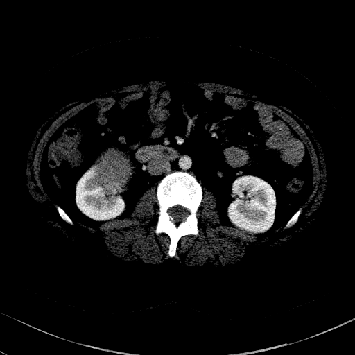</td>
<td>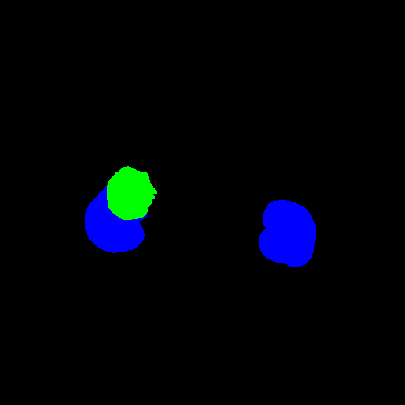</td>
<td>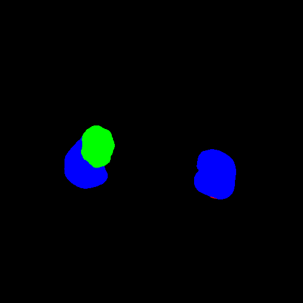</td>
</tr>

<tr>
<td>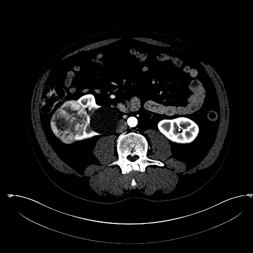</td>
<td></td>
<td>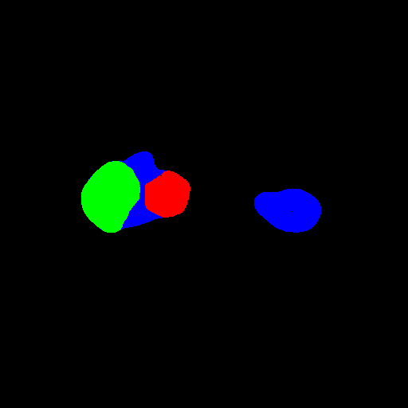</td>
</tr>

<tr>
<td>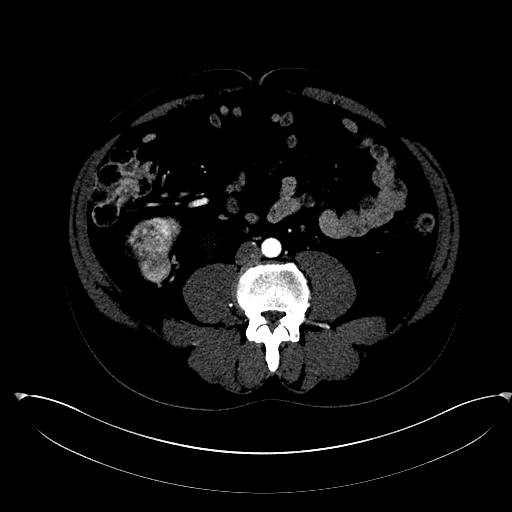</td>
<td></td>
<td>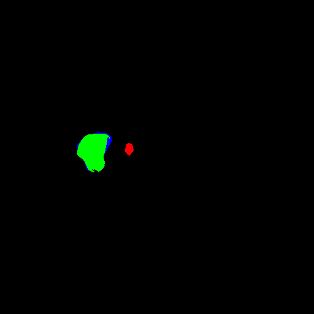</td>
</tr>
</table>

 
<h3>1. Dataset Citation</h3>
The dataset used here was taken from   
<a href="https://www.kaggle.com/datasets/fizzazaitoonbsds2022/3d-kidney-tumor-segmentation/data">
<b>3D CT Kidney for Tumor Segmentation </b>
Annotated 3D kidney CT scans with tumors for research and AI experiments
</a> by Fizza Zaitoon.
  

The following explanation was taken from the above kaggle web site. 
  
<b>About Dataset</b> 
<b>Dataset Description</b> 
This dataset offers <b>high-quality 3D kidney CT scans</b> with <b>expertly annotated tumors and cysts</b>, 
ideal for AI research in <b>tumor and kidney segmentation</b>. 
 Derived from KiTS23, 
it provides full volumetric scans along with precise masks, enabling accurate model development and evaluation.
  
<b>Highlights</b> 
<ul>
<li>Total Cases: 489</li>
<li>Composition: 241 Tumor-only, 248 Tumor+Cyst</li>
<li>Annotations: Tumor, Cyst, Kidney, Background</li>
<li>Data Format: .nii.gz 3D CT volumes</li>
<li>Intended Use: Tumor and kidney segmentation</li>
<li>Cons: Only 30/31 cases in this dataset are complete, rest do not have imaging.nii.gz file. (Will try to upload complete soon).</li>
</ul>
<b>Citation</b> 
<pre>
@misc{heller2023kits21,
  title={The KiTS21 Challenge: Automatic segmentation of kidneys, renal tumors, and renal cysts in corticomedullary-phase CT}, 
  author={Nicholas Heller and Fabian Isensee and Dasha Trofimova and Resha Tejpaul and Zhongchen Zhao and Huai Chen and Lisheng Wang and Alex Golts and Daniel Khapun and Daniel Shats and Yoel Shoshan and Flora Gilboa-Solomon and Yasmeen George and Xi Yang and Jianpeng Zhang and Jing Zhang and Yong Xia and Mengran Wu and Zhiyang Liu and Ed Walczak and Sean McSweeney and Ranveer Vasdev and Chris Hornung and Rafat Solaiman and Jamee Schoephoerster and Bailey Abernathy and David Wu and Safa Abdulkadir and Ben Byun and Justice Spriggs and Griffin Struyk and Alexandra Austin and Ben Simpson and Michael Hagstrom and Sierra Virnig and John French and Nitin Venkatesh and Sarah Chan and Keenan Moore and Anna Jacobsen and Susan Austin and Mark Austin, Subodh Regmi, Nikolaos Papanikolopoulos, Christopher Weight},
  year={2023},
  eprint={2307.01984},
  archivePrefix={arXiv},
  primaryClass={cs.CV}
}

</pre>
 
<b>License</b> 
<a href="https://creativecommons.org/publicdomain/zero/1.0/">
CC0: Public Domain
</a>
 
 
<h3>
<a id="2">
2 3D-CT-Kidney-Tumor ImageMask Dataset
</a>
</h3>
 If you would like to train this 3D-CT-Kidney-Tumor Segmentation model by yourself,
 please download the dataset from the google drive  
 <a href="https://drive.google.com/file/d/1T8EW7ip9XDVstkREqQ3zljYWvzRlWHYn/view?usp=sharing">
3D-CT-Kidney-Tumor-ImageMask-Dataset.zip</a> (<a href="https://interoperable-europe.ec.europa.eu/licence/creative-commons-attribution-40-international-cc-40">
CC BY 4.0
</a>)
, expand the downloaded ImageMaskDataset and put it under <b>./dataset</b> folder to be
 
<pre>
./dataset
└─3D-CT-Kidney-Tumor
    ├─test
    │   ├─images
    │   └─masks
    ├─train
    │   ├─images
    │   └─masks
    └─valid
        ├─images
        └─masks
</pre>
 
<b>3D-CT-Kidney-Tumor Statistics</b> 
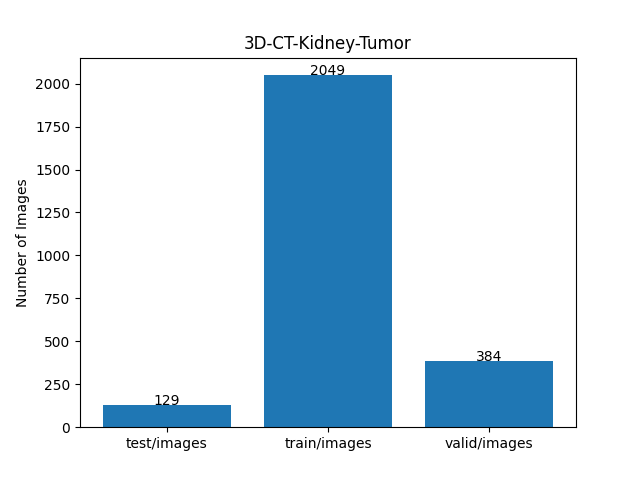 
 
As shown above, the number of images of train and valid datasets is large enough to use for the
 training set of our segmentation model.
 
 
We used a simple Python script to generate our 
PNG dataset with colorized masks from the pairs of <b>"*imaging.nii.gz"</b> and
<b>"*segmentation.nii.gz"</b> of 3D-CT-Kidney-Tumor.
For simplicity, we excluded all empty black masks and their corresponding images,
which were irrelevant to train our segmentation model.  
.
<b>Train sample images</b> 
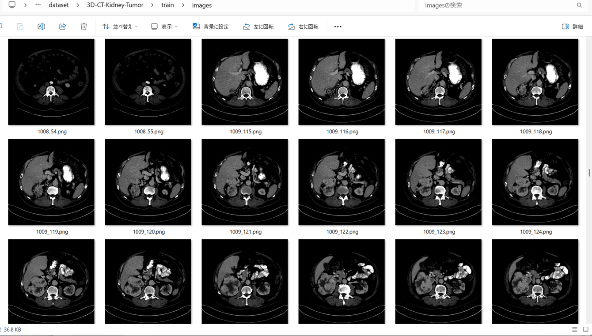
 
<b>Train sample masks</b> 
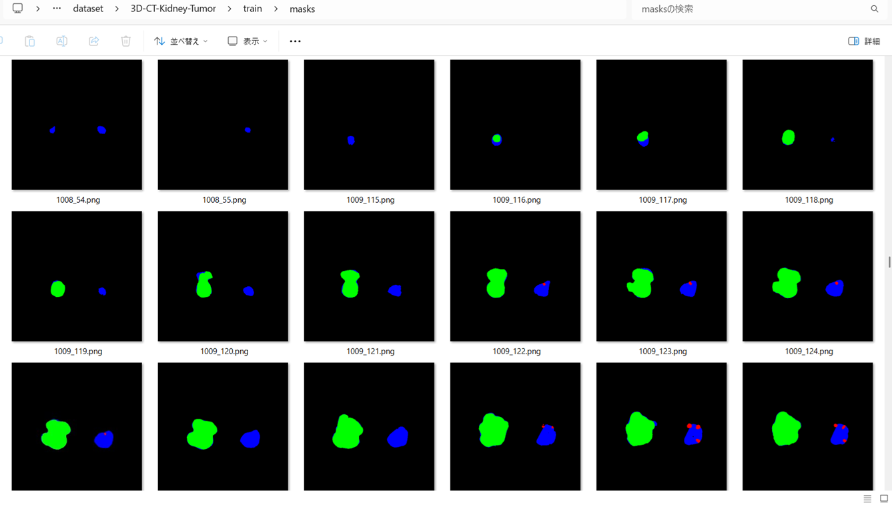
 

<h3>
3 Train TensorFlowFlexUNet Model
</h3>
 We trained 3D-CT-Kidney-Tumor TensorFlowFlexUNet Model by using the 
<a href="./projects/TensorFlowFlexUNet/3D-CT-Kidney-Tumor/train_eval_infer.config"> <b>train_eval_infer.config</b></a> file.  
Please move to ./projects/TensorFlowFlexUNet/3D-CT-Kidney-Tumor and run the following bat file. 
<pre>
>1.train.bat
</pre>
, which simply runs the following command. 
<pre>
>python ../../../src/TensorFlowFlexUNetTrainer.py ./train_eval_infer.config
</pre>

<b>Model parameters</b> 
Defined a small <b>base_filters=16 </b> and large <b>base_kernels=(11,11)</b> for the first Conv Layer of Encoder Block of 
<a href="./src/TensorFlowFlexUNet.py">TensorFlowFlexUNet.py</a> 
and a large <b>num_layers=8</b> (including a bridge between Encoder and Decoder Blocks).
<pre>
[model]
;You may specify your own UNet class derived from our TensorFlowFlexModel
model         = TensorFlowFlexUNet"
image_width    = 512
image_height   = 512
image_channels = 3
input_normalize = True
normalization  = False
num_classes    = 4
base_filters   = 16
base_kernels   = (11,11)
num_layers     = 8
dropout_rate   = 0.04
dilation       = (1,1)
</pre>
<b>Learning rate</b> 
Defined a small learning rate.  
<pre>
[model]
learning_rate  = 0.00007
</pre>
<b>Loss and metrics functions</b> 
Specified "categorical_crossentropy" and <a href="./src/dice_coef_multiclass.py">"dice_coef_multiclass"</a>. 
<pre>
[model]
loss           = "categorical_crossentropy"
metrics        = ["dice_coef_multiclass"]
</pre>
<b>Dataset class</b> 
Specifed <a href="./src/ImageCategorizedMaskDataset.py">ImageCategorizedMaskDataset</a> class. 
<pre>
[dataset]
class_name    = "ImageCategorizedMaskDataset"
</pre>
 
<b>Learning rate reducer callback</b> 
Enabled learing_rate_reducer callback, and a small reducer_patience.
<pre> 
[train]
learning_rate_reducer = True
reducer_factor     = 0.4
reducer_patience   = 4
</pre>
<b>Early stopping callback</b> 
Enabled early stopping callback with patience parameter.
<pre>
[train]
patience      = 10
</pre>
<b>RGB Color map</b> 
Specifed rgb color map dict for 3D-CT-Kidney-Tumor 1+3 classes. 
<pre>
[mask]
mask_datatyoe    = "categorized"
mask_file_format = ".png"
;3D-CT-Kidney-Tumorrgb color map dict for 1+3 classes.
;                      Kidney:blue,   Cyst:green,  Tumor:red
rgb_map = {(0,0,0):0, (0,0,255):1, (0,255,0):2, (255,0,0):3 }
</pre>
<b>Epoch change inference callback</b> 
Enabled <a href="./src/EpochChangeInferencer.py">epoch_change_infer callback</a></b>. 
<pre>
[train]
epoch_change_infer       = True
epoch_change_infer_dir   =  "./epoch_change_infer"
num_infer_images         = 6
</pre>
By using this callback, on every epoch_change, the inference procedure can be called
 for 6 images in <b>mini_test</b> folder. This will help you confirm how the predicted mask changes 
 at each epoch during your training process.  
  
<!--
As shown below, early in the model training, the predicted masks from our UNet segmentation model showed 
discouraging results.
 However, as training progressed through the epochs, the predictions gradually improved. 
   
-->
 
<b>Epoch_change_inference output at starting (epoch 1,2,3)</b> 
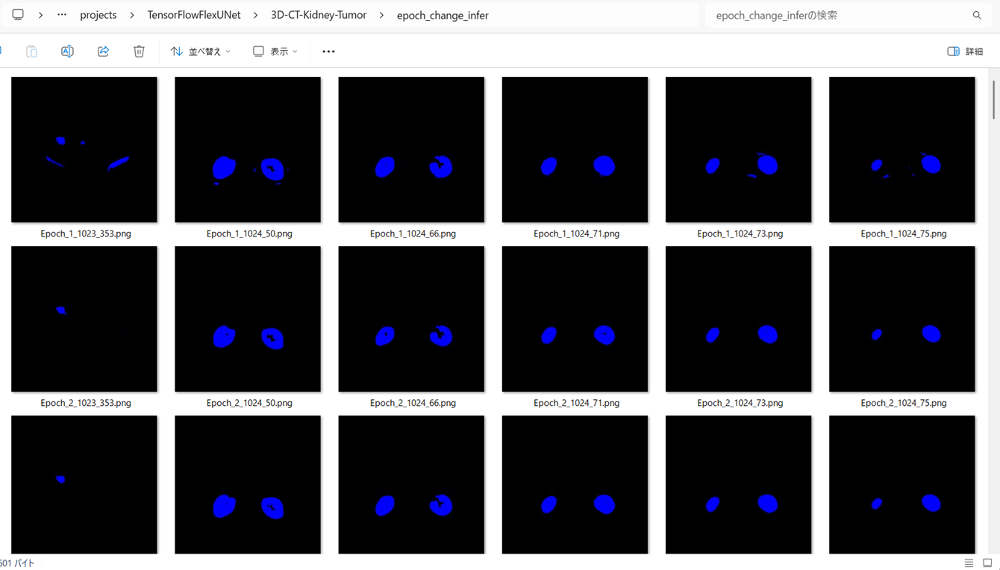 
 
<b>Epoch_change_inference output at middlepoint (epoch 16,17,18)</b> 
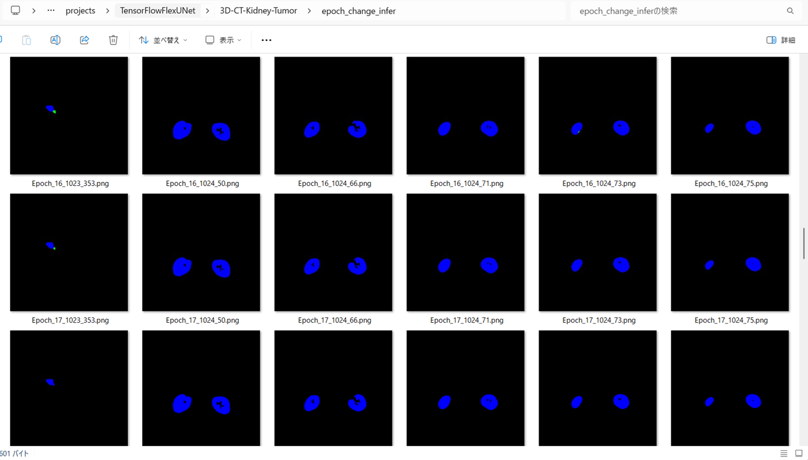 
 

<b>Epoch_change_inference output at ending (epoch 32,33,34)</b> 
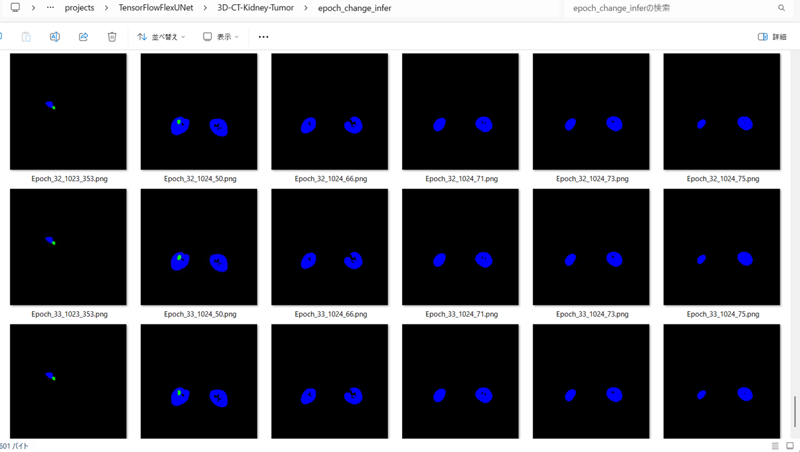 
 

In this experiment, the training process was stopped at epoch 46 by EarlyStopping callback.  
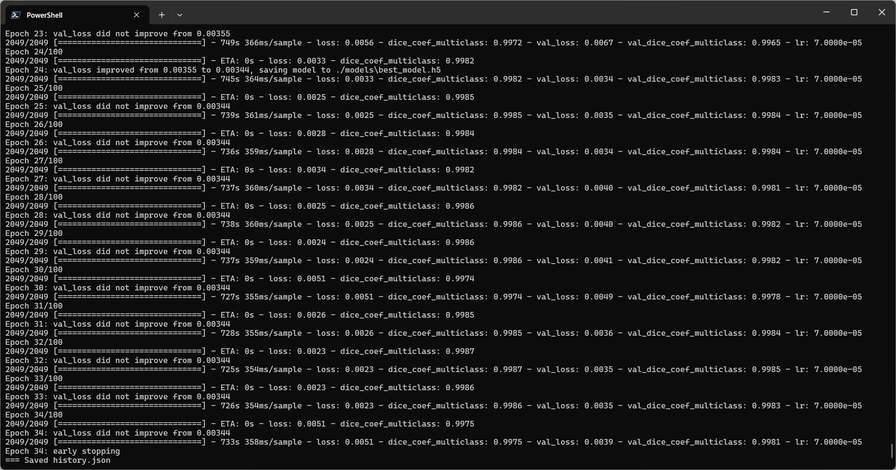 
 

<a href="./projects/TensorFlowFlexUNet/3D-CT-Kidney-Tumor/eval/train_metrics.csv">train_metrics.csv</a> 
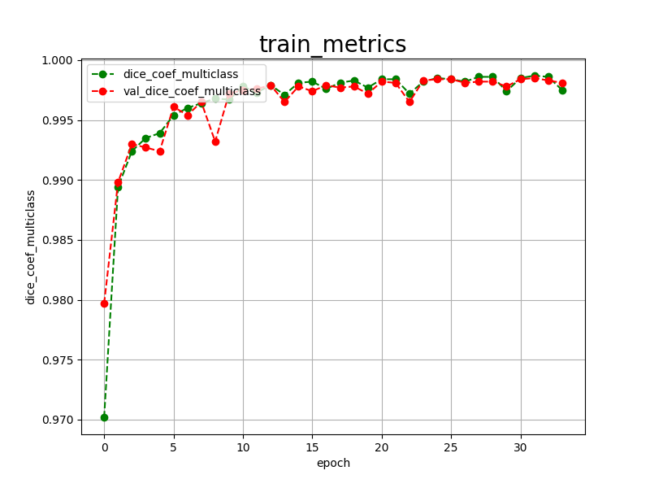 

 
<a href="./projects/TensorFlowFlexUNet/3D-CT-Kidney-Tumor/eval/train_losses.csv">train_losses.csv</a> 
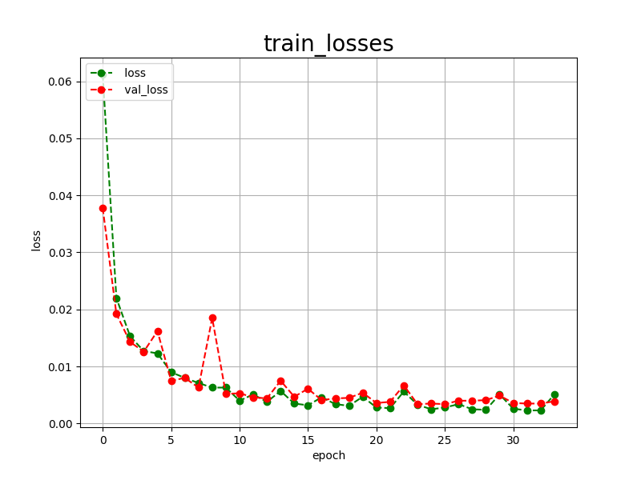 
 
<h3>
4 Evaluation
</h3>
Please move to <b>./projects/TensorFlowFlexUNet/3D-CT-Kidney-Tumor</b> folder, 
and run the following bat file to evaluate TensorFlowUNet model for 3D-CT-Kidney-Tumor. 
<pre>
./2.evaluate.bat
</pre>
This bat file simply runs the following command.
<pre>
python ../../../src/TensorFlowFlexUNetEvaluator.py ./train_eval_infer_aug.config
</pre>

Evaluation console output: 
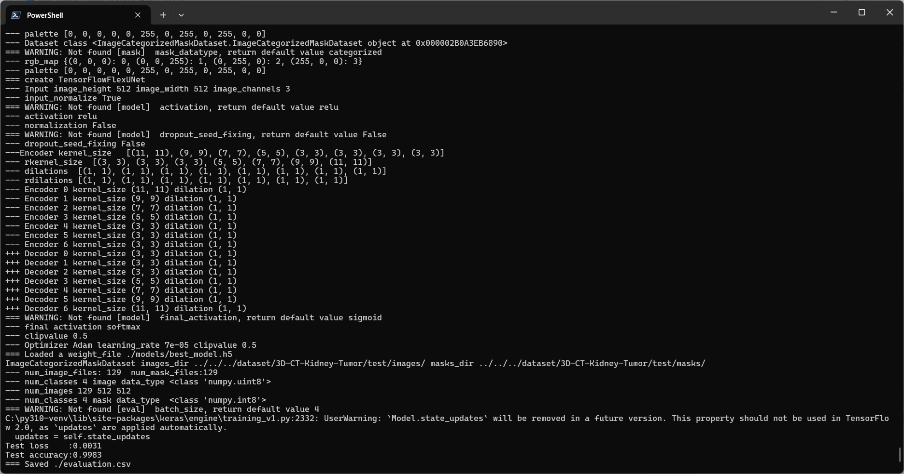
  Image-Segmentation-3D-CT-Kidney-Tumor

<a href="./projects/TensorFlowFlexUNet/3D-CT-Kidney-Tumor/evaluation.csv">evaluation.csv</a> 
The loss (categorical_crossentropy) to this <b>3D-CT-Kidney-Tumor/test</b> was not low and dice_coef_multiclass not high as shown below.
 
<pre>
categorical_crossentropy,0.0031
dice_coef_multiclass,0.9983
</pre>
 
<h3>
5 Inference
</h3>
Please move to a <b>./projects/TensorFlowFlexUNet/3D-CT-Kidney-Tumor</b> folder 
,and run the following bat file to infer segmentation regions for images by the Trained-TensorFlowUNet model for 3D-CT-Kidney-Tumor. 
<pre>
./3.infer.bat
</pre>
This simply runs the following command.
<pre>
python ../../../src/TensorFlowFlexUNetInferencer.py ./train_eval_infer_aug.config
</pre>

<b>mini_test_images</b> 
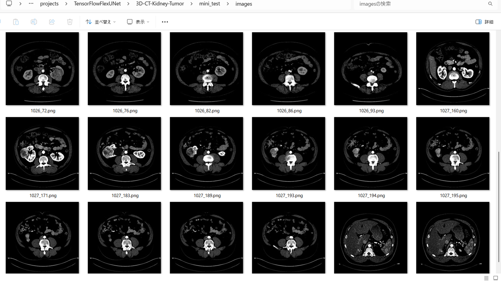 
<b>mini_test_mask(ground_truth)</b> 
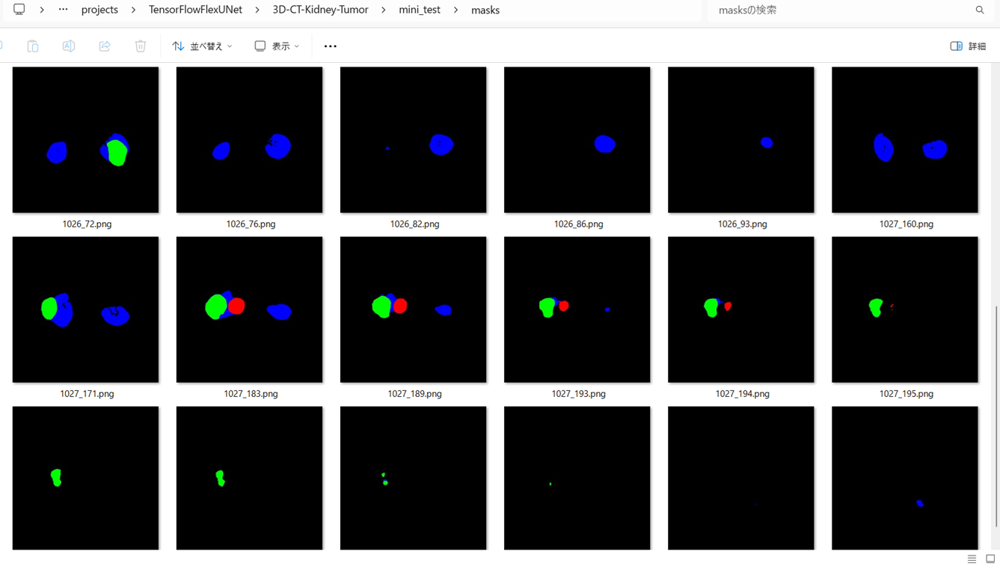 

<b>Inferred test masks</b> 
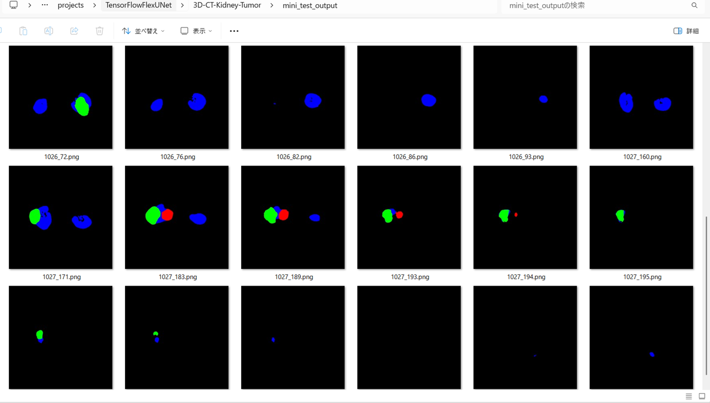 
 

<b>Enlarged images and masks of 3D-CT-Kidney-Tumor Images</b> 
As shown below, the inferred masks predicted by our segmentation model trained by the dataset appear similar to the ground truth masks,
 but they lack precision in certain areas.
  
<b>class_color_map = {Kidney:blue, Cyst:green, Tumor:red}</b>
  
<table>
<tr>
<th>Image</th>
<th>Mask (ground_truth)</th>
<th>Inferred-mask</th>
</tr>
<tr>
<td>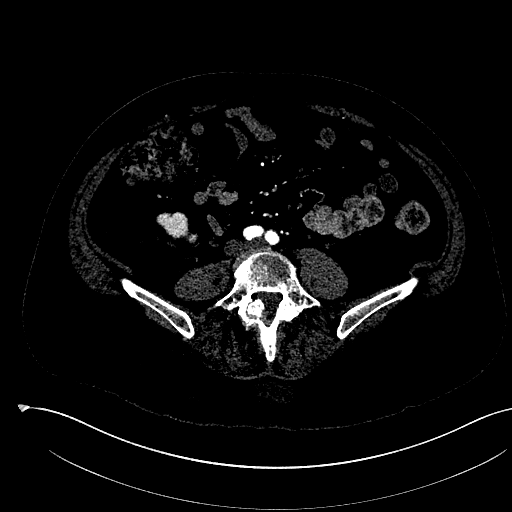</td>
<td>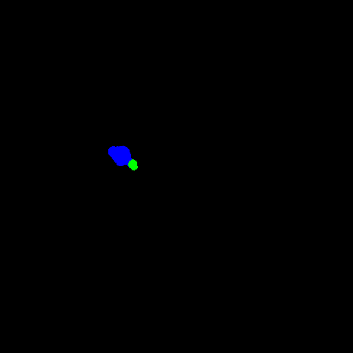</td>
<td>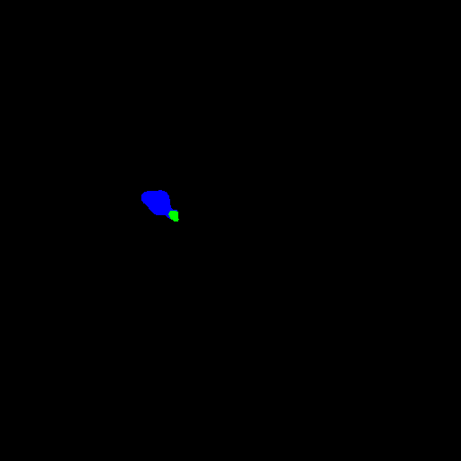</td>
</tr>

<tr>
<td>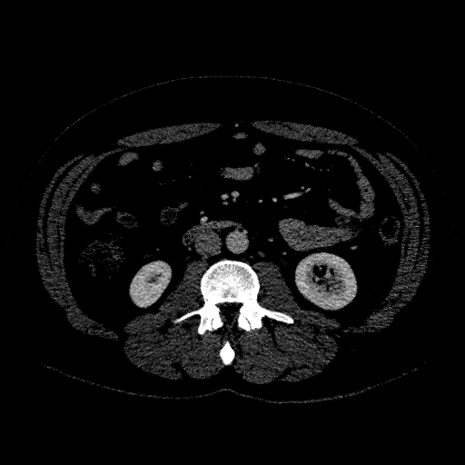</td>
<td></td>
<td>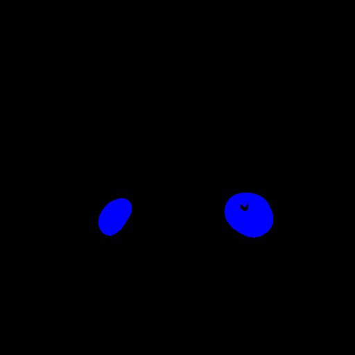</td>
</tr>

<tr>
<td>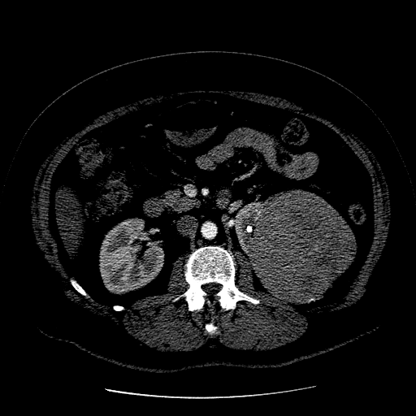</td>
<td></td>
<td>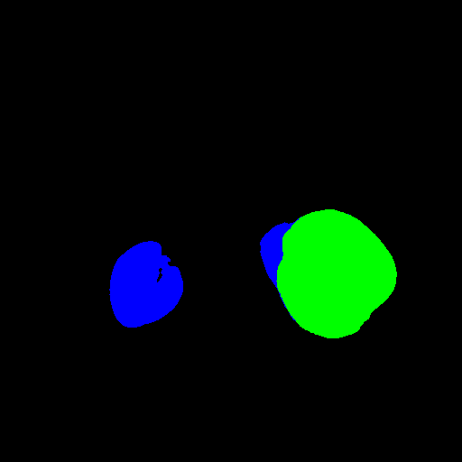</td>
</tr>

<tr>
<td></td>
<td></td>
<td></td>
</tr>

<tr>
<td>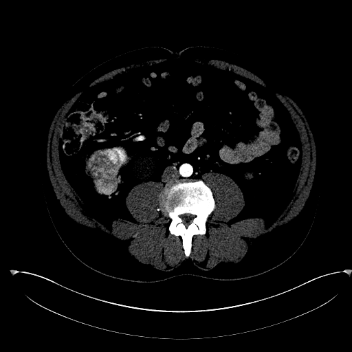</td>
<td>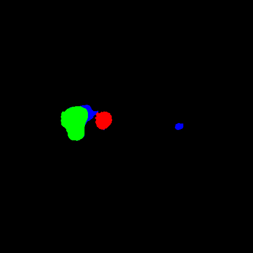</td>
<td>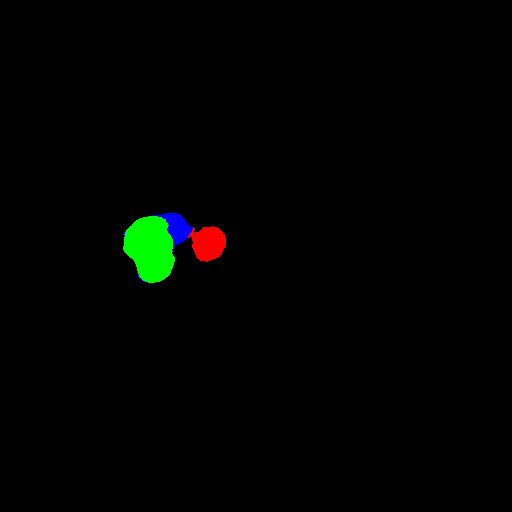</td>
</tr>

<tr>
<td>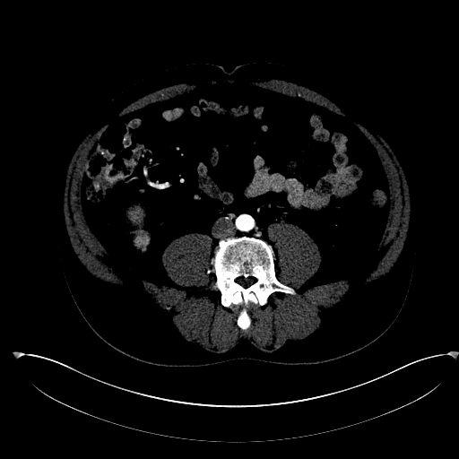</td>
<td>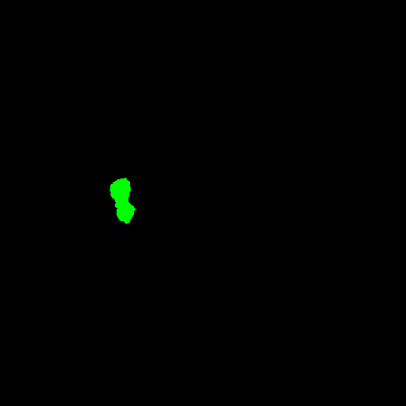</td>
<td>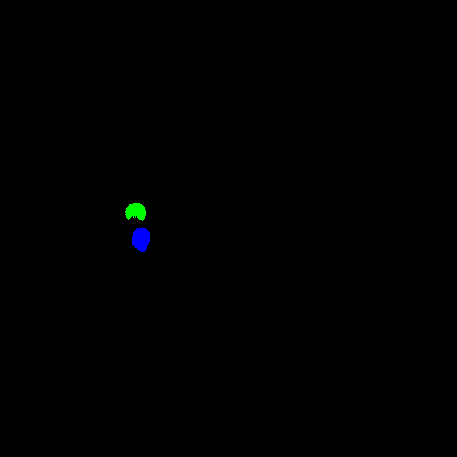</td>
</tr>
</table>

 
 
<h3>
6 3D Volume Segmentation
</h3>
Please move <b>./projects/TensorFlowFlexUNet/3D-CT-Kidney-Tumor</b> folder, and run the following bat file to infer images segmentation for 2D slices of 3D volume NIfTI files
 by the Trained-TensorFlowFlexUNet model for 3D-CT-Kidney-Tumor. 
<pre>
>./5.infer3d.bat
</pre>
This simply runs the following command.
<pre>
>python ../../../src/TensorFlowFlexUNet3DInferencer.py ./train_eval_infer.config
</pre>

<b>infer3d section </b> in <a href="./projects/TensorFlowFlexUNet/3D-CT-Kidney-Tumor/train_eval_infer.config">
train_eval_infer.config
<a></b>
<pre>
[infer3d] 
;Specify an images_dir which contains NIfTI files
images_dir    = "./mini_test_3d/images/"
output_dir    = "./mini_test_3d_output/"
slice_shape_order = "dhw"
slice_normalize = False
slice_resize   = (512,512)
slice_rotation = None
mask_overlay  = True
</pre>

<b>Acutual Image Segmentation for 2D Slices of a 3D-CT-Kidney-Tumor NIfTI</b> 
Some Slices, Inferred Masks and Mask overlays for a 3D volume <b>case_00016_imaging.nii.gz</b> file. 
 
<b>class_color_map = {Kidney:blue, Cyst:green, Tumor:red}</b>
 
<table>
<tr>
<th>Input: Slice</th>
<th>Prediction: Inferred mask</th>
<th>Mask Overlay</th>
</tr>
<tr>
<td>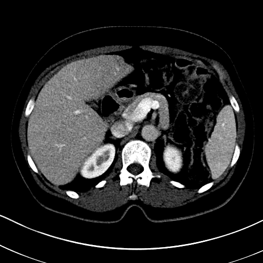</td>
<td>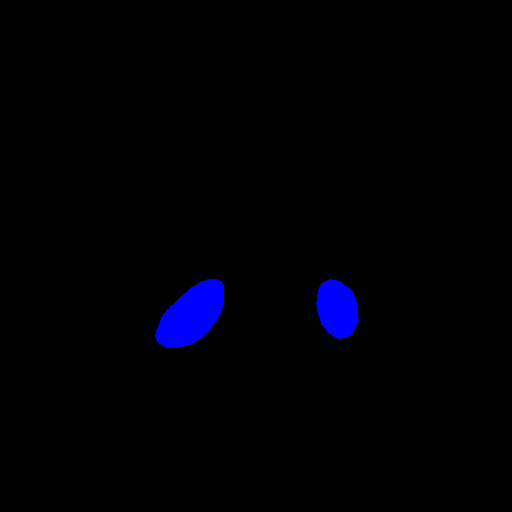</td>
<td>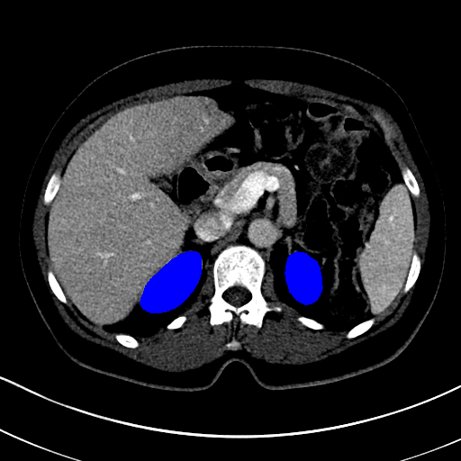</td>
</tr>
<tr>
<td>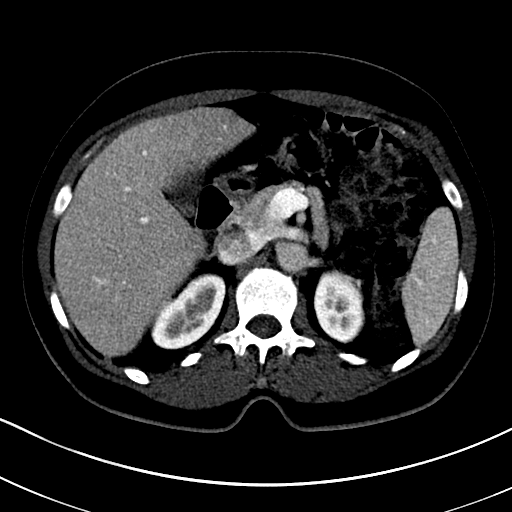</td>
<td>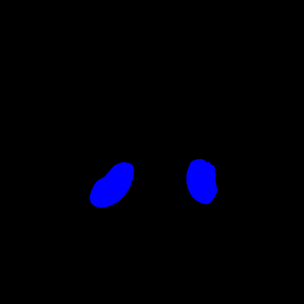</td>
<td>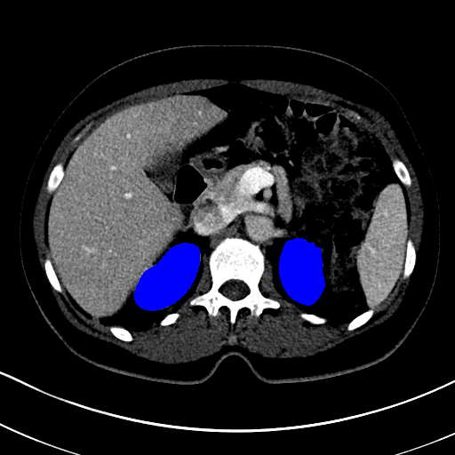</td>
</tr>
<tr>
<td>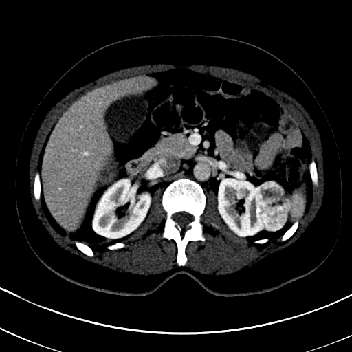</td>
<td>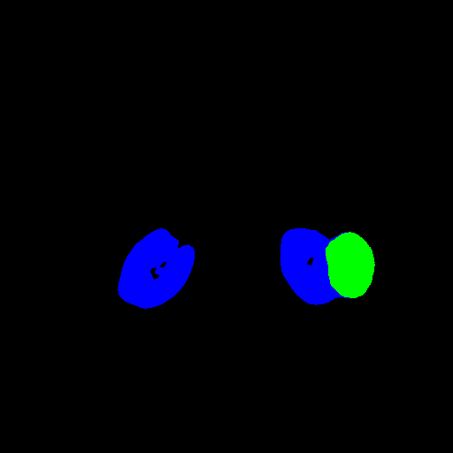</td>
<td>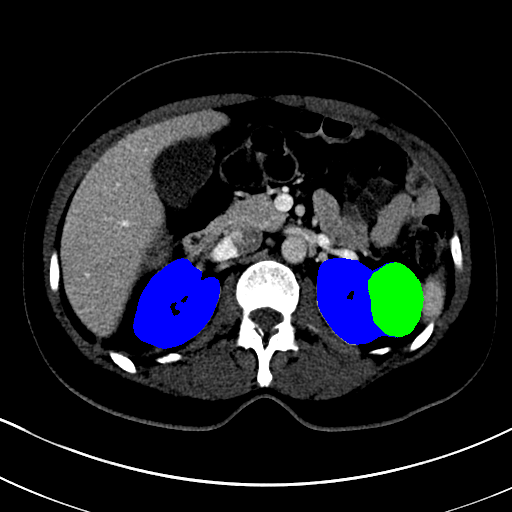</td>
</tr>
<tr>
<td>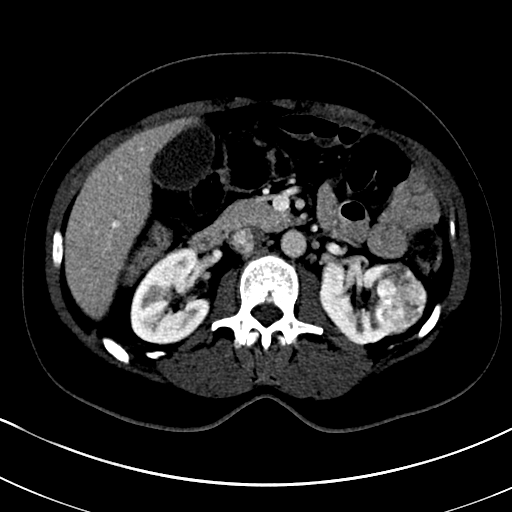</td>
<td>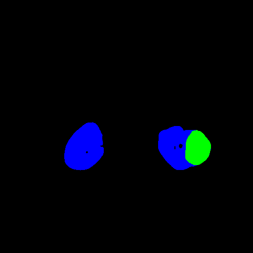</td>
<td>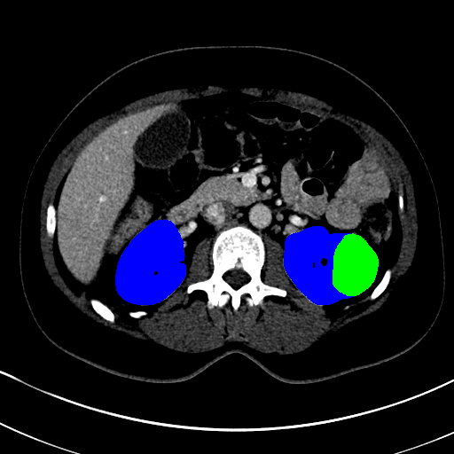</td>
</tr>
<tr>
<td>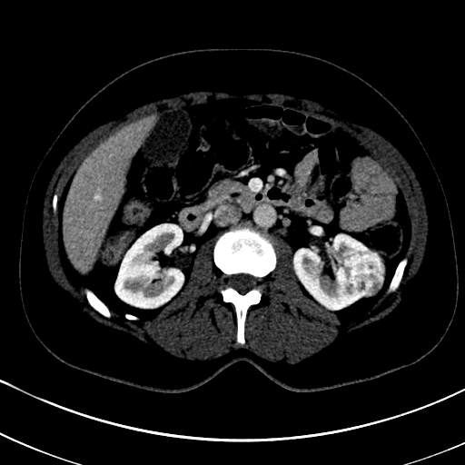</td>
<td>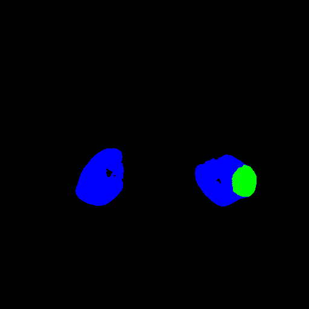</td>
<td>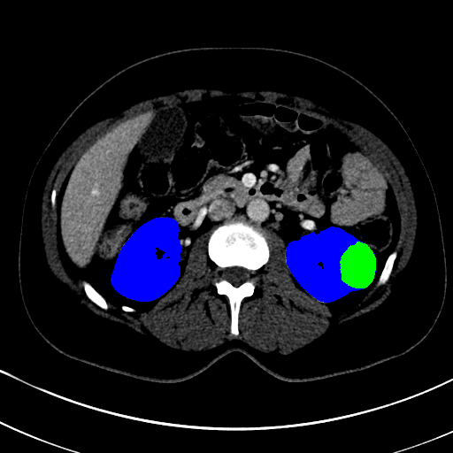</td>
</tr>
<tr>
<td>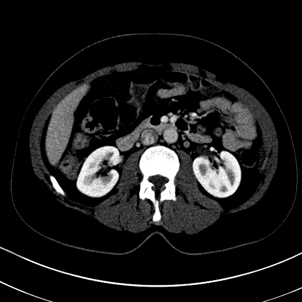</td>
<td>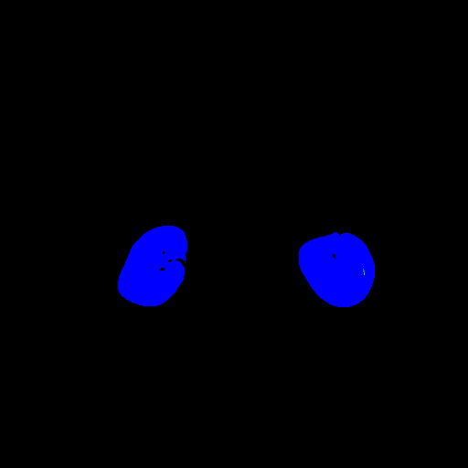</td>
<td>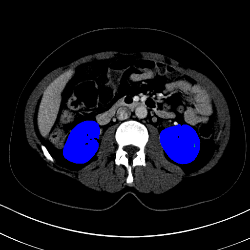</td>

</tr>
</table>

 
 
<h3>
7 MaskOverlay Video of 3D Volume Segmentation
</h3>
Please move to <b>./projects/TensorFlowFlexUNet/3D-CT-Kidney-Tumor</b> folder, and run the following bat file 
to generate <b>overlays.mp4</b> or <b>overlay.gif</b> for MaskOverlays of 3D Volume Segmentation.  
<pre>
>./6.video3d.bat
</pre>
This simply runs the following command.
<pre>
>python ../../../src/MaskOverlayVideoGenerator.py ./train_eval_infer.config
</pre>
 

<b>infer3d section </b> in <a href="./projects/TensorFlowFlexUNet/3D-CT-Kidney-Tumor/train_eval_infer.config">
train_eval_infer.config
<a></b>

<pre>
[infer3d] 
mask_overlay  = True
;Specify ".mp4" or ".gif".
;video_fileformat  = ".mp4"
video_fileformat  = ".gif"
</pre>
 
<b>overlays.gif</b> 
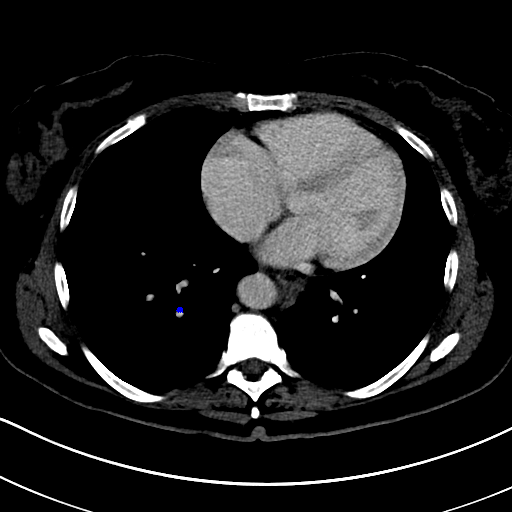
 
 
<h3>
References
</h3>
<b>1. TensorFlow-FlexUNet-Image-Segmentation-KiTS19-Kidney-Tumor</b> 
Toshiyuki Arai 
<a href="https://github.com/sarah-antillia/TensorFlow-FlexUNet-Image-Segmentation-KiTS19-Kidney-Tumor">
https://github.com/sarah-antillia/TensorFlow-FlexUNet-Image-Segmentation-KiTS19-Kidney-Tumor</a>
  
<b>2. TensorFlow-FlexUNet-Image-Segmentation-Model</b> 
Toshiyuki Arai 
<a href="https://github.com/sarah-antillia/TensorFlow-FlexUNet-Image-Segmentation-Model">
https://github.com/sarah-antillia/TensorFlow-FlexUNet-Image-Segmentation-Model</a>
  

